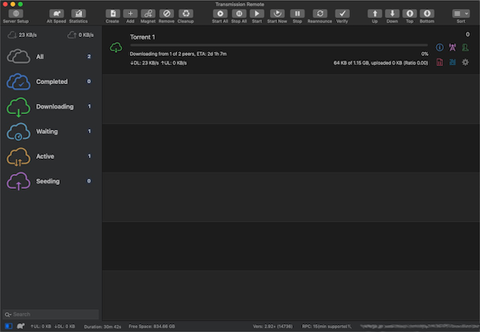
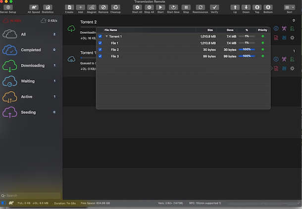
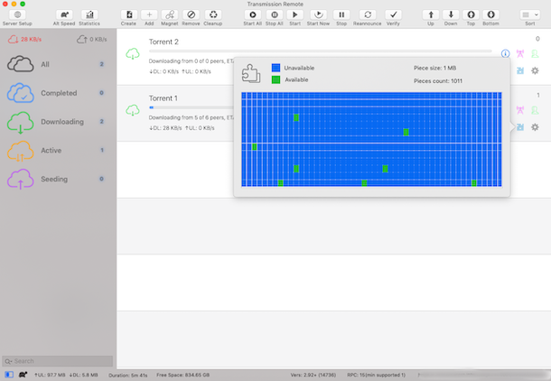
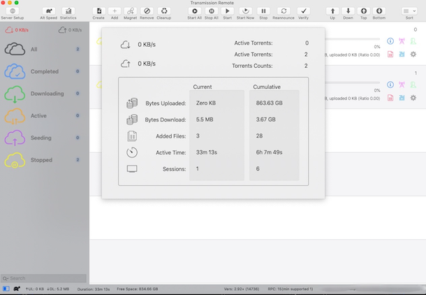

# Transmission Remote

Transmission Remote is a Transmission client built exclusively for Mac, developed with the last features available in macOS.  The client allow to control a Transmission daemon through the RPC protocol..

## Features:

- Dark Mode ready
- macOS Notifications
* Server connections synchronized between multiple computers, using iCloud.
* Utility to create Torrent Files.
* Selection of Files to download
* Use of drag and drop to reorder download queue
*  Swipe right/left gestures to access functions as Start/Stop/Delete/Reannounce,etc.
* Allow the addition of new Torrents using files or MagnetURL.
* Graphical information of Peers and Files Pieces activity
* Status Menu Bar
* Integration with the OS to open downloaded files.
  
 
 

## Installation:

The application can be downloaded directly from the release page.  It require macOS 10.14 (Mojave)

- To build the application using the source code:

Transmission Remote was compiled using Xcode 10.

Download the source code cloning the repository using the command

`git clone https://github.com/jvega1976/TransmissionRemote.git`.

Before building the app, make sure that the repository submodules have been updated, executing the command

`git submodule update` inside the local repository (the directory where the source code was downloaded).

The core code for the RPC connection to the transmission daemon is done using the original code from the really great iOS App “TransShift” by @github/alcheck Alexey Chechetkin.

Transmission Remote source code is opensource, I developed it because I wanted to have a good macOS app to connect and control remotely a transmission daemon.
